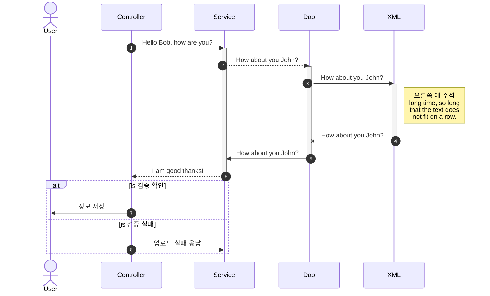

# #뒤에 공백넣고 제목

1. 강조표시

​        \*\*을 두번 넣어서 강조\*\*

​         ** **을 두번넣어서 강조**

2. 기울임

​        \*를 한번 넣어서 기울임\*

​        *\*를 한번 넣어서 기울임*

3. 혼용사용

​       \*\*와 \*를 \*혼용\*해서 사용\*\*

​       **\*\*와 \*를 *혼용*해서 사용  **

4. 취소선

​        \~\~물결을 두번 사용해서 취소선 \~\~

​       ~~\~\~ 물결을 두번 사용해서 취소선~~

5. 순서있는 목록

​       숫자적고 . 적고 공백하면 순서있는 목록

6. \- , \* , \+ 순서없는 목록

   - -를 적고 공백주면  순서없는 목록
   * \*를 적고 공백
   + +를 적고 공백

7. ---를 세번 주고 엔터하면 선긋기

   ---

   --------

8. 링크주기

   화면에 표시할 글은 `[]`(대괄호)로 감싸고, 이동할 주소에는 `()`(괄호)를 감싸서 입력하면 자동으로 링크를 생성할 수 있습니다.

   \[네이버이동\]\(http://naver.com\)

   [네이버이동](http://naver.com)

9. \`\`\`를 3번 주고 엔터치면 블럭주기

```
블럭 처리
```

10. 공백  \[ 공백 \]  공백 을 주어서 체크박스 만들기
- [ ] 사과

- [ ] 배

- [ ] 귤
- [ ] 한글

11. \`\`\`를 3번 주고  sequence 하면 sequence diagram

\```sequeence

```
   User -> 포탈인버터장비Controller   : 정보요청

   포탈인버터장비Controller -> 포탈인버터장비Controller : 유효성체크
   포탈인버터장비Controller -> 포탈인버터장비Service : 정보요청
   포탈인버터장비Service -> 포탈인버터장비Mapper : 정보요청
   포탈인버터장비Mapper -> Database : 정보요청
   Note right of Database : 설비_에너지사용량기준목록
   Database -> 포탈인버터장비Mapper : return 정보결과
   포탈인버터장비Mapper -> 포탈인버터장비Service : 정보결과
   포탈인버터장비Service -> 포탈인버터장비Controller : 정보결과
   Note left of 포탈인버터장비Controller : 예외여부 체크
   포탈인버터장비Controller -> User : 인버터장비 등록결과 JSON Object\\n-건물ID,오브젝트ID,장비명
```

```sequence

User -> 포탈인버터장비Controller   : 정보요청

포탈인버터장비Controller -> 포탈인버터장비Controller : 유효성체크
포탈인버터장비Controller -> 포탈인버터장비Service : 정보요청
포탈인버터장비Service -> 포탈인버터장비Mapper : 정보요청
포탈인버터장비Mapper -> Database : 정보요청
Note right of Database : 설비_에너지사용량기준목록
Database -> 포탈인버터장비Mapper : return 정보결과
포탈인버터장비Mapper -> 포탈인버터장비Service : 정보결과
포탈인버터장비Service -> 포탈인버터장비Controller : 정보결과
Note left of 포탈인버터장비Controller : 예외여부 체크
포탈인버터장비Controller -> User : 인버터장비 등록결과 JSON Object\\n-건물ID,오브젝트ID,장비명
```

12. \`\`\`를 3번 주고  mermaid 하면 sequence diagram

\```mermaid

```
sequenceDiagram

autonumber

participant User
participant Controller

participant Service

participant Dao

participant XML

Controller ->> Service: Hello Bob, how are you?

activate Service

Service -->>Dao: How about you John?

activate Dao

Dao ->> XML: How about you John?

activate XML

Note right of XML: 오른쪽 에 주석 <br/>long time, so long<br/>that the text does<br/>not fit on a row.

XML--x Dao: How about you John?

deactivate XML

Dao->> Service: How about you John?

deactivate Dao

Service-->> Controller : I am good thanks!

deactivate Service

alt is 검증 확인

   Controller  ->> User: 정보 저장

else is 검증 실패

  Controller  ->>Service: 업로드 실패 응답

end
```



12. \```flow 를 하면 flowchart

\```flow

```
st=>start: Start

op=>operation: Your Operation

cond=>condition: Yes or No?

e=>end

st->op->cond

cond(yes)->e

cond(no)->op
```

```flow
st=>start: Start

op=>operation: Your Operation

cond=>condition: Yes or No?

e=>end

st->op->cond

cond(yes)->e

cond(no)->op
```


12.첫번째행을  -(하이픈)으로 구별하고 각열을 |(수직선기호) 로 구별하여 표를 만든다.

|첫째행 | 둘째행|  하고 엔터

| 행1  | 행2  |
|:--- | --- |
| 열11 | 열2  |

| 첫째행 | 둘째행 |
| --- | --- |
|     |     |

​