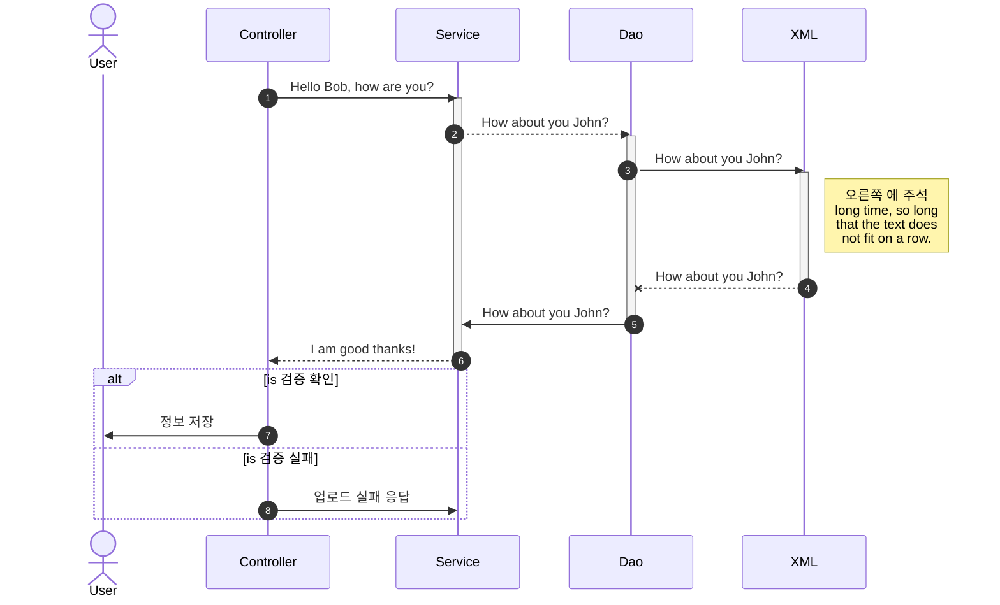

# #뒤에 공백넣고 제목 #

== 목차 ==

[1. 강조표시](#1.-강조표시)
[2. 기울임](#2.-기울임)
[3. 혼용사용​](#3.-혼용사용​)
[4. 취소선](#4.-취소선)
[5. 밑줄](#5.-밑줄)
[6. 인용문](#6.-인용문)
[7. 순서있는 목록](#7.-순서있는-목록)
[8. - , * , + 순서없는 목록](#8.----,-*-,-+-순서없는-목록)
[9. ---를 세번 주고 엔터하면 선긋기](#9.----를-세번-주고-엔터하면-선긋기)
[10. 링크주기](#10.-링크주기)
[11. 이미지 (Images) 붙이기](#11.-이미지-(Images)-붙이기)
[12. \`\`\`를 주고 엔터치면 블럭주기](#12.-```를-주고-엔터치면-블럭주기)
[13. \`로 일부 글자에 대해 인라인 블럭주기](#13.-로-일부-글자에-대해-인라인-블럭주기)
[14. 공백 [ 공백] 공백 을 주어서 체크박스 만들기](#14.-공백-[공백]-공백-을-주어서-체크박스-만들기)

[15. 주석 달기](#15.-주석-달기)
[16. 목차 생성](#16.-목차-생성)
[17. 각주 달기](#17.-각주-달기)
[18. \`\`\`를 주고 plant uml하면 sequence diagram](#18.를-주고-plant-uml하면-sequence-diagram)
[19. \`\`\`를 주고 sequence 하면 sequence diagram](#19.-```를-주고-sequence-하면-sequence-diagram)

[20. \`\`\`를 주고 mermaid 하면 sequence diagram](#20.-```를-주고-mermaid-하면-sequence-diagram)

[22. \`\`\`flow 를 하면 flowchart](#22.-```flow-를-하면-flowchart)


{:10. 링크주기}


#### 1. 강조표시
&nbsp;&nbsp;  \*\*을 앞뒤로  넣어서 강조\*\*
&nbsp;&nbsp;  ** **을 앞뒤로 넣어서 강조**


#### 2. 기울임
  \*를 한번 넣어서 기울임\*
  *\*를 한번 넣어서 기울임*

#### 3. 혼용사용​
    \*\*와 \*를 \*혼용\*해서 사용\*\*
    **\*\*와 \*를 *혼용*해서 사용  **

#### 4. 취소선
​    \~\~물결을 두번 사용해서 취소선 \~\~
    ~~\~\~ 물결을 두번 사용해서 취소선~~

#### 5. 밑줄
   \<u>밑줄 주기가 가능하다.\</u>
   <u>밑줄 주기가 가능하다.</u>

#### 6. 인용문
   \>로  인용문장을 줄수있다.
   \>>중첩된 인용문
   \>>>중첩된 인용문 2
   > 인용문장을 줄수있다.
   >> 중첩된 인용문
   >>> 중첩된 인용문 2


#### 7. 순서있는 목록
    숫자적고 . 적고 공백하면 순서있는 목록

#### 8. \- , \* , \+ 순서없는 목록
   - -를 적고 공백주면  순서없는 목록
   * \*를 적고 공백
   + +를 적고 공백

#### 9.  ---를 세번 주고 엔터하면 선긋기

   ---

   --------

## test
## 링크주기
#### 10. 링크주기

   화면에 표시할 글은 `[]`(대괄호)로 감싸고, 이동할 주소에는 `()`(괄호)를 감싸서 입력하면 자동으로 링크를 생성할 수 있습니다.

   `[네이버이동`]`(http://naver.com`)

   [네이버이동](http://naver.com)

#  이미지 (Images) 붙이기

#### 11. 이미지 (Images) 붙이기

   !\[대체텍스트](이미지주소)  와 같이 주면 된다.

   
   <br/>

   \[!\[대체텍스트](이미지주소)](링크주소)  와 같이 주면 링크도 된다.

   [](http://naver.com)
   <br/>

#### 12. ```를 주고 엔터치면 블럭주기
   \```를 주고 언어를 주면 해당 언어(language)로 색상주기 가능

   <br>
   ```
   블럭 처리
   ```

   ```
   블럭 처리
   ```

   ======================
   \```java
     블럭 처리
   \```

   ```java
   public doSearch(String id, string pwd){
       String result = id+pwd;
       return result;
   }
   ```
   ======================
   \```html
     블럭 처리
   \```

   ```html
   <table><tr><td>블럭 처리</td></tr></table>
   <a href="javascript:alert('3')">테스트 </a>
   ```
   ====================
   \```css
     블럭 처리
   \```

   ```css
    .div{
      background-color : red
    }
   ```
   ====================
   \```javascript
     블럭 처리
   \```

   ```javascript
    function doSearch(){
      let cond = '';
      console.log("cond"+cond);
    }
   ```
   ====================
<br/>

#### 13. `로 일부 글자에 대해 인라인 블럭주기
  \`일부 글자\` 블럭주기

  `일부 글자` 블럭주기
  <br/>

#### 14. 공백  `[공백`] 공백 을 주어서 체크박스 만들기
   - [ ] 사과
   - [ ] 배
   - [ ] 귤
   - [x] 체크내용
<br/>

#### 15. 주석 달기
   \<!-- 주석 달기 -->
   <!-- 주석 달기 -->

#### 16. 목차 생성
  ```
    문서 내에 사용된 헤딩 태그들을 이용하여 {:toc} 입력 시 목차가 자동 생성된다
    또는
    [보여지는 내용](#링크)
  ```
  {:목차 생성} 테스트 목차
  [16.목차 생성하는법](#16._목차_생성)


#### 17. 각주 달기
  ```
    마크다운 장난[^장난]없이 많이 좋다.[^총평]

    [^장난]:마크다운 사용법1
    [^총평]:마크다운 사용법2
  ```

  마크다운 장난[^장난]없이 많이 좋다.[^총평]
  [^장난]:마크다운 사용법1
  [^총평]:마크다운 사용법2

  마크다운 장난[^장난2]없이 많이 좋다.  [^총평2]
  [^장난2]:마크다운 사용법11
  [^총평2]:마크다운 사용법22

<br/>

#### 18.\`\`\`를 주고 plant uml하면 sequence diagram

  ```
    ```plantuml
    Alice -> Bob: Authentication Request
    Bob --> Alice: Authentication Response

    Alice -> Bob: Another authentication Request
    Alice <-- Bob: another authentication Response
    ```
  ```

   ```plantuml
   Alice -> Bob: Authentication Request
   Bob --> Alice: Authentication Response

   Alice -> Bob: Another authentication Request
   Alice <-- Bob: another authentication Response
   ```


===


\```plantuml
```
autonumber
actor "사용자"
participant "사용자" order 10
participant "설비Controller" order 20
participant "설비Service" order 30
participant "설비Mapper" order 40
database "Azure DataBase\n tsopdev" order 50
participant "Azure DataBase\n tsopdev" order 50


actor "사용자"
"사용자" --> "설비Controller" :  GET : /api/dashboar/fm/buiding/summay
'"설비Controller" --> "설비Service" :  선언
'"설비Controller" --> "설비Service" :  선언

'database "Azure DataBase\n tsopdev"
'"설비Service" --> "Azure DataBase\n tsopdev" : 선언

activate "설비Controller"
"설비Controller" ->  "설비Service" : 빌딩별 설비운전시간조회

activate "설비Service"
"설비Service" ->  "설비Mapper" : 빌딩별 전력사용량 조회

activate "설비Mapper"
"설비Mapper" ->  "Azure DataBase\n tsopdev" : Select 빌딩 위도,경도

activate "Azure DataBase\n tsopdev"
"Azure DataBase\n tsopdev" --> "설비Mapper"   : return 빌딩 위도,경도
note right : 구성_건물기본\n(OIV_BUILDING)
deactivate "Azure DataBase\n tsopdev"

"설비Mapper" -->  "설비Service" : 빌딩별 전력사용량 조회 결과 LIST
deactivate "설비Mapper"

"설비Service" -->  "설비Controller" : 빌딩별 설비운전시간조회 결과 LIST
deactivate "설비Service"

"설비Controller" ->  "사용자" : 빌딩별 설비운전 시간 결과 JSON Object
deactivate "설비Controller"

'deactivate "설비Controller"

'activate "설비Controller"


"설비Controller" ->  "설비Controller" : 위,경도 TM좌표 반환
note left : 예외여부 체크
'deactivate "설비Controller"

alt is 검증 확인
    "설비Controller"  ->> "사용자": 정보 저장
else is 검증 실패
    "설비Controller"  ->> "설비Service": 업로드 실패 응답
end

```

```plantuml

autonumber
actor "사용자"
participant "사용자" order 10
participant "설비Controller" order 20
participant "설비Service" order 30
participant "설비Mapper" order 40
database "Azure DataBase\n tsopdev" order 50
participant "Azure DataBase\n tsopdev" order 50


actor "사용자"
"사용자" --> "설비Controller" :  GET : /api/dashboar/fm/buiding/summay
'"설비Controller" --> "설비Service" :  선언
'"설비Controller" --> "설비Service" :  선언

'database "Azure DataBase\n tsopdev"
'"설비Service" --> "Azure DataBase\n tsopdev" : 선언

activate "설비Controller"
"설비Controller" ->  "설비Service" : 빌딩별 설비운전시간조회

activate "설비Service"
"설비Service" ->  "설비Mapper" : 빌딩별 전력사용량 조회

activate "설비Mapper"
"설비Mapper" ->  "Azure DataBase\n tsopdev" : Select 빌딩 위도,경도

activate "Azure DataBase\n tsopdev"
"Azure DataBase\n tsopdev" --> "설비Mapper"   : return 빌딩 위도,경도
note right : 구성_건물기본\n(OIV_BUILDING)
deactivate "Azure DataBase\n tsopdev"

"설비Mapper" -->  "설비Service" : 빌딩별 전력사용량 조회 결과 LIST
deactivate "설비Mapper"

"설비Service" -->  "설비Controller" : 빌딩별 설비운전시간조회 결과 LIST
deactivate "설비Service"

"설비Controller" ->  "사용자" : 빌딩별 설비운전 시간 결과 JSON Object
deactivate "설비Controller"

'deactivate "설비Controller"


'activate "설비Controller"


"설비Controller" ->  "설비Controller" : 위,경도 TM좌표 반환
note left : 예외여부 체크
'deactivate "설비Controller"


alt is 검증 확인
    "설비Controller"  ->> "사용자": 정보 저장
else is 검증 실패
    "설비Controller"  ->> "설비Service": 업로드 실패 응답
end


```


====

#### 19. \`\`\`를 주고 sequence 하면 sequence diagram

```
   ```sequeence{theme="hand or simple"}
   User -> 포탈인버터장비Controller   : 정보요청

   포탈인버터장비Controller -> 포탈인버터장비Controller : 유효성체크
   포탈인버터장비Controller -> 포탈인버터장비Service : 정보요청
   포탈인버터장비Service -> 포탈인버터장비Mapper : 정보요청
   포탈인버터장비Mapper -> Database : 정보요청
   Note right of Database : 설비_에너지사용량기준목록
   Database -> 포탈인버터장비Mapper : return 정보결과
   포탈인버터장비Mapper -> 포탈인버터장비Service : 정보결과
   포탈인버터장비Service -> 포탈인버터장비Controller : 정보결과
   Note left of 포탈인버터장비Controller : 예외여부 체크
   포탈인버터장비Controller -> User : 인버터장비 등록결과 JSON Object\\n-건물ID,오브젝트ID,장비명
```

## mermaid sequence
Here is a Hello World example.

```sequence{theme="simple"}

User -> 포탈인버터장비Controller   : 정보요청
포탈인버터장비Controller -> 포탈인버터장비Controller : 유효성체크
포탈인버터장비Controller -> 포탈인버터장비Service : 정보요청
포탈인버터장비Service -> 포탈인버터장비Mapper : 정보요청
포탈인버터장비Mapper -> Database : 정보요청
Note right of Database : 설비_에너지사용량기준목록
Database -> 포탈인버터장비Mapper : return 정보결과
포탈인버터장비Mapper -> 포탈인버터장비Service : 정보결과
포탈인버터장비Service -> 포탈인버터장비Controller : 정보결과
Note left of 포탈인버터장비Controller : 예외여부 체크
포탈인버터장비Controller -> User : 인버터장비 등록결과 JSON Object\n-건물ID,오브젝트ID,장비명
```


#### 20. \`\`\`를 주고  mermaid 하면 sequence diagram

\```mermaid
```
sequenceDiagram

autonumber
participant User
participant Controller
participant Service
participant Dao
participant XML

Controller ->> Service: Hello Bob, how are you?

activate Service
Service -->>Dao: How about you John?

activate Dao
Dao ->> XML: How about you John?

activate XML
Note right of XML: 오른쪽 에 주석 <br/>long time, so long<br/>that the text does<br/>not fit on a row.

XML--x Dao: How about you John?
deactivate XML

Dao->> Service: How about you John?
deactivate Dao

Service-->> Controller : I am good thanks!
deactivate Service

alt is 검증 확인
   Controller  ->> User: 정보 저장

else is 검증 실패
  Controller  ->>Service: 업로드 실패 응답

end
```


## mermaid sequence diagram
Here is a Hello World example.




#### 22. \```flow 를 하면 flowchart

\```flow

```
nStart=>start: Start(start)

nOperation=>operation: Your Operation(operation)
nCondition=>condition: Yes or

No(condition)?

nEnd=>end: End(end)

nStart->nOperation->nCondition

nCondition(yes)->nEnd
nCondition(no)->nOperation
```

## mermaid flow
Here is a Hello World example.

```flow
nStart=>start: Start(start)

nOperation=>operation: Your Operation(operation)
nCondition=>condition: Yes or

No(condition)?

nEnd=>end: End(end)

nStart->nOperation->nCondition

nCondition(yes)->nEnd
nCondition(no)->nOperation
```


---

\```flow
```
nStart=>start: Start내용(start):>http://www.google.com[blank]
nEnd=>end: End내용(end):> http://www.google.com
nLoginForm=>operation: 로그인(operation)
nLoginLog=>subroutine: 로그인로그(subroutine)
nDatabase1=>subroutine: Database1
nDatabase2=>subroutine: Database2
pLoginCheck=>condition: Yes or No?(condition):>http://www.google.com
pLoginSucces=>inputoutput: Main화면(inputoutput)...
pLoginFail=>parallel: 여러작업만(parallel)

nStart->nLoginForm->pLoginCheck
pLoginCheck(yes)->pLoginSucces->nEnd
pLoginCheck(no)->pLoginFail

pLoginFail(path1, bottom)->nLoginLog(right)->nLoginForm
pLoginFail(path2, top)->nLoginForm
pLoginFail(path3, right)->nDatabase1

nLoginLog(bottom)->nDatabase2
```

## flowchart  (```flow)  http://flowchart.js.org/ 의 flowchar.js를 보면 속성들이 있다.
```flow
nStart=>start: Start내용(start):>http://www.google.com[blank]
nEnd=>end: End내용(end):> http://www.google.com
nLoginForm=>operation: 로그인(operation)
nLoginLog=>subroutine: 로그인로그(subroutine)
nDatabase1=>subroutine: Database1
nDatabase2=>subroutine: Database2
pLoginCheck=>condition: Yes or No?(condition):>http://www.google.com
pLoginSucces=>inputoutput: Main화면(inputoutput)...
pLoginFail=>parallel: 여러작업만(parallel)

nStart->nLoginForm->pLoginCheck
pLoginCheck(yes)->pLoginSucces->nEnd
pLoginCheck(no)->pLoginFail

pLoginFail(path1, bottom)->nLoginLog(right)->nLoginForm
pLoginFail(path2, top)->nLoginForm
pLoginFail(path3, right)->nDatabase1

nLoginLog(bottom)->nDatabase2
```

----
\```flow
```
## flowchart  (```flow)  http://flowchart.js.org/ 의 flowchar.js를 보면 속성들이 있다.

```flow
nStart=>start: Start(start)|past:>http://www.google.com[blank]
nEnd=>end: End(end)|future:>http://www.google.com

nOperation1=>operation: 작업1(operation)|past
nOperation2=>operation: 작업2(operation)|current

nSubroutine=>subroutine: 서브루틴(subr..)|invalid
nCondition1=>condition: Yes
or No?(condition)|approved:>http://www.google.com

nCondition2=>condition: Good idea|rejected

nInputoutput=>inputoutput: catch something(inputoutput)...|future

nStart->nOperation1(right)->nCondition1

nCondition1(yes, right)->nCondition2
nCondition1(no)->nSubroutine(left)->nOperation1

nCondition2(yes)->nInputoutput->nEnd
nCondition2(no)->nOperation2->nEnd
```


## flowchart  (```flow)  http://flowchart.js.org/ 의 flowchar.js를 보면 속성들이 있다.
```flow
nStart=>start: Start(start)|past:>http://www.google.com[blank]
nEnd=>end: End(end)|future:>http://www.google.com

nOperation1=>operation: 작업1(operation)|past
nOperation2=>operation: 작업2(operation)|current

nSubroutine=>subroutine: 서브루틴(subr..)|invalid
nCondition1=>condition: Yes
or No?(condition)|approved:>http://www.google.com

nCondition2=>condition: Good idea|rejected

nInputoutput=>inputoutput: catch something(inputoutput)...|future

nStart->nOperation1(right)->nCondition1

nCondition1(yes, right)->nCondition2
nCondition1(no)->nSubroutine(left)->nOperation1

nCondition2(yes)->nInputoutput->nEnd
nCondition2(no)->nOperation2->nEnd
```

20.첫번째행을  -(하이픈)으로 구별하고 각열을 |(수직선기호) 로 구별하여 표를 만든다.

|첫째행 | 둘째행|  하고 엔터

| 헤더1  | 헤더2  |  헤더3  |
|:--- | ---: |:---: |
| 좌측 정렬 | 우측 정렬233  | 중앙정렬  |
| 열1 | 열2  | 열3  |

| 첫째행 | 둘째행 |
| --- | --- |
|     |     |

​