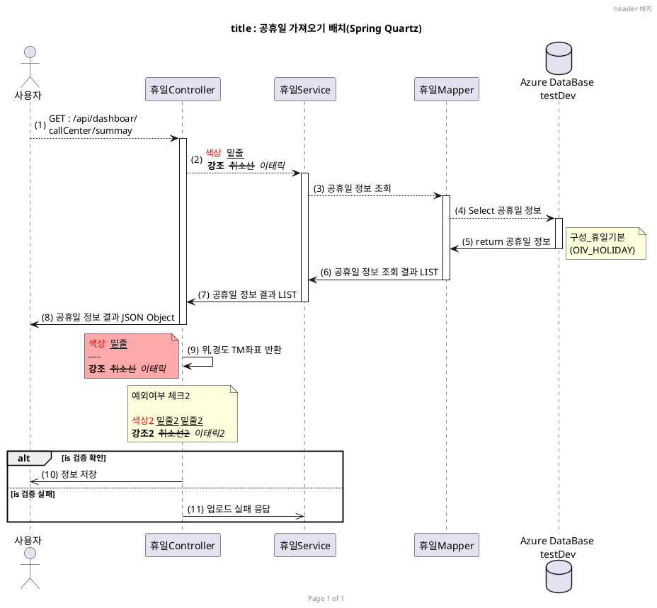
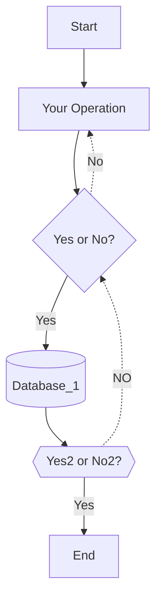
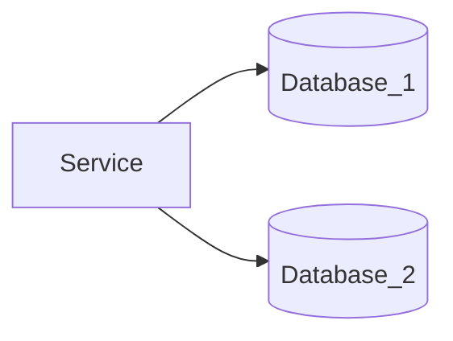

__문서제목__


== 목차 ==
<!-- 아래처럼주면 자동으로 목차가 생성된다. --> 
<!-- @import "[TOC]" {cmd="toc" depthFrom=1 depthTo=6 orderedList=false} -->

<!-- code_chunk_output -->

- [1. 제목표시](#1-제목표시)
- [2. 강조표시](#2-강조표시)
- [3. 기울임](#3-기울임)
- [4. 혼용사용](#4-혼용사용)
- [5. 취소선](#5-취소선)
- [6. 밑줄](#6-밑줄)
- [7. 글자 정렬](#7-글자-정렬)
- [8. 글자 색,배경 변경](#8-글자-색배경-변경)
- [9. 형광팬](#9-형광팬)
- [10. 인용문](#10-인용문)
- [11. 순서있는 목록](#11-순서있는-목록)
- [8. \- , \* , \+ 순서없는 목록](#8-------순서없는-목록)
- [12.  ---를 세번 주고 엔터하면 선긋기](#12---를-세번-주고-엔터하면-선긋기)
- [13. 토글 리스트 (접기/펼치기)](#13-토글-리스트-접기펼치기)
- [14. 링크주기 - ```a href link 방식```](#14-링크주기----a-href-link-방식)
- [15. 링크주기 - ```설명{:target="_blank"} 방식```](#15-링크주기----설명urltarget_blank-방식)
- [16. 인라인 HTML](#16-인라인-html)
- [17. 이미지 (Images) 붙이기- ``` 방식```](#17-이미지-images-붙이기---대체텍스트이미지주소-방식)
- [17. 이미지 (Images) 붙이기-``` 방식```](#17-이미지-images-붙이기--대체텍스트이미지주소링크주소-방식)
- [18. ```를 주고 엔터치면 블럭주기](#18-를-주고-엔터치면-블럭주기)
- [19. `로 일부 글자에 대해 인라인 블럭주기](#19-로-일부-글자에-대해-인라인-블럭주기)
- [20. `* 공백[공백]` 공백 을 주어서 체크박스 만들기](#20--공백공백-공백-을-주어서-체크박스-만들기)
- [21. 주석 달기](#21-주석-달기)
- [22. 목차 생성](#22-목차-생성)
- [23. 각주 달기](#23-각주-달기)
- [24. 축약어 (HTML)](#24-축약어-html)
- [25.\```plant uml하면 plantuml sequence diagram](#25font-colorredplant-umlfont하면-plantuml-sequence-diagram)
- [26. \```mermaid sequenceDiagram하면 mermaid sequence diagram](#26-font-colorredmermaid-sequencediagramfont하면-mermaid-sequence-diagram)
- [27. \```mermaid flowchart 하면 mermaid flowchart diagram](#27-font-colorredmermaid-flowchartfont-하면-mermaid-flowchart-diagram)
- [28. \```mermaid pie하면 mermaid pie diagram](#28-font-colorredmermaid-piefont하면-mermaid-pie-diagram)
- [29. \```sequence하면 markdown sequence diagram](#29-font-colorredsequencefont하면-markdown-sequence-diagram)
- [30. \```flow 를 하면 markdown flowchart](#30-font-colorredflowfont-를-하면-markdown-flowchart)
- [31. 테이블 만들기](#31-테이블-만들기)

<!-- /code_chunk_output -->

    

#### 1. 제목표시
  
  ```html
    h1: # 부(parts)에 사용됨.
    h2: ## 장(chapters)에 사용됨.
    h3: ### 페이지 섹션에 사용함.
    h4: #### 하위 섹션에 사용됨.
    h5: ##### 하위 섹션 아래의 하위 섹션에 사용됨.
    h6: ###### 문단에
  ```
 ```markdown {highlight=1-6}
    # 부(parts)에 사용됨.
    ## 장(chapters)에 사용됨.
    ### 페이지 섹션에 사용함.
    #### 하위 섹션에 사용됨.
    ##### 하위 섹션 아래의 하위 섹션에 사용됨.
    ###### 문단에
 ```
<br/>

#### 2. 강조표시 

  ```html
   **을 앞뒤로  넣어서 강조**
  ```

  ** **을 앞뒤로 넣어서 강조**
  
  ```html
    __볼드체(double underscores)__
  ```
  __볼드체(double underscores)__

 

#### 3. 기울임
  ```html 
   *를 한번 넣어서 기울임*
  ```

  \* *를 한번 넣어서 기울임*
  
  ```html 
    _이탤릭체(single underscores)_
  ``` 

   _이탤릭체(single underscores)_

#### 4. 혼용사용
  ```html
      **와 *를 *혼용*해서 사용**
  ```
    
  ** **와 \*를 *혼용*해서 사용**

  ```html
    **_이텔릭체_와 두껍게**를 같이 사용할 수 있습니다.  
  ```
    
  **_이텔릭체_와 두껍게**를 같이 사용할 수 있습니다.  

        
  ```html
   __*이텔릭체*와 두껍게__를 같이 사용할 수 있습니다.  
  ```
  
  __*이텔릭체*와 두껍게__를 같이 사용할 수 있습니다.  


  ```html
   **_이탤릭체와 볼드체 함께_**
  ```  
  **_이탤릭체와 볼드체 함께_**

#### 5. 취소선 
  ```html
   ~~물결을 두번 사용해서 취소선 ~~
  ```
 
  \~~~~물결을 두번 사용해서 취소선~~

#### 6. 밑줄 
  
  ```html
    <u>밑줄 주기가 가능하다.</u> 
  ```
   <u>밑줄 주기가 가능하다.</u> 


#### 7. 글자 정렬
  - 마크다운은 가운데 정렬만 지원함. 왼쪽 오른쪽은 html 사용해야함
  ```html
  <center>가운데</center>  
  <div style="text-align: left">왼쪽</div>  
  <div style="text-align: right">오른쪽</div> 
  ```

  <center>가운데</center>  
  <div style="text-align: left">왼쪽</div>  
  <div style="text-align: right">오른쪽</div>  

<br/>

#### 8. 글자 색,배경 변경
 - 마크다운에서 따로 지원하지 않아서 html 사용해야함
 ```
 <span style="background-color: #11999e; color:white">글자 색, 배경 변경</span>
 ```
  <span style="background-color: #11999e; color:white">글자 색, 배경 변경</span>
 
<br>

#### 9. 형광팬
  - \<mark>형광팬\</mark>
  <mark>형광팬</mark>
  <mark color="red">형광팬</mark>

#### 10. 인용문
  - \>로  인용문장을 줄수있다.
    \>>중첩된 인용문
    \>>>중첩된 인용문 2
  
   > 인용문장을 줄수있다.
   >> 중첩된 인용문
   >>> 중첩된 인용문 2
   > * List 2
 
 
>> **<i class="fa fa-exclamation-triangle" aria-hidden="true"></i> 주의:** 이 구문은 마크다운 인용구 문법 입니다.

>> *<i class="fa fa-info-circle" aria-hidden="true"></i> 정보:* 이 구문은 마크다운 인용구 문법 입니다.

>> **<i class="fa fa-question-circle"></i> 질문:** 
>> 질문 답변입니다. 
>>
>> 


#### 11. 순서있는 목록
  - 숫자적고 . 적고 공백하면 순서있는 목록
  1. 순서
     1. 순서 1-1
        1. 순서
     2. 순서 1-2
  2. 순서2

#### 8. \- , \* , \+ 순서없는 목록
   - -를 적고 공백주면  순서없는 목록
     * \*를 적고 공백
        + +를 적고 공백

#### 12.  ---를 세번 주고 엔터하면 선긋기
  ```html
     ---
     ***
  ```
   ---
   ***
    

#### 13. 토글 리스트 (접기/펼치기)
```
  <details>
  <summary><b><font color='red'>여기를 눌러주세요</font></b></summary>
  <div markdown="1">       
    
    감춰진 테스트
  😎숨겨진 내용😎
    감춰진 테스트2

  </div>
  </details>
```

<details>
<summary><b><font color='red'>여기를 눌러주세요</font></b></summary>
<div markdown="1">       
   
  감춰진 테스트
😎숨겨진 내용😎
  감춰진 테스트2

</div>
</details>

 <br>
 <br>

#### 14. 링크주기 - ```a href link 방식```
   
   - 새창으로 링크 : a href link 방식 - 이 방식이 모든 markdown에서도 지원
   ```html
      <a href="https://www.google.co.kr/" target="_blank"> https://www.google.co.kr/ </a>
   ```

   <a href="https://www.google.co.kr/" target="_blank"> https://www.google.co.kr/ </a>
  
  <br/>

#### 15. 링크주기 - ```[설명](URL){:target="_blank"} 방식```
  - 화면에 표시할 글은 `[]`(대괄호)로 감싸고, 이동할 주소에는 `()`(괄호)를 감싸서 입력하면 자동으로 링크를 생성할 수 있습니다.
   
  - 링크주기 
    ```html
     [네이버이동](http://naver.com)
    ```
    [네이버이동](http://naver.com)     
  <br/>

  - 새창으로 링크
     ```html
     ['네이트이동'](http://www.nate.com/){:target="_blank"}
     ```
     ['네이트이동'](http://www.nate.com/){:target="_blank"}     
  <br/>


  - 새창으로 버튼 링크
     ```html
    ['test'](http://www.nate.com/){:.btn .btn-default target="_blank"}
     ```
    ['네이트이동'](http://www.nate.com/){:.btn .btn-default target="_blank"}
  <br/>


 


#### 16. 인라인 HTML
  - 마크다운에서 원시 HTML을 사용할 수도 있으며 대부분 잘 작동합니다. 하지만 PDF가 아닌 웹 사이트에만 표시됩니다.
  ```html
    <dl>
      <dt>아이템 1 제목</dt>
      <dd>아이템 1 내용 입니다.</dd>
      <dt>아이템 2 제목</dt>
      <dd>아이템 2 내용 입니다.</dd>
    </dl>

  ```

  <dl>
    <dt>아이템 1 제목</dt>
    <dd>아이템 1 내용 입니다.</dd>
    <dt>아이템 2 제목</dt>
    <dd>아이템 2 내용 입니다.</dd>
  </dl>


#### 17. 이미지 (Images) 붙이기- ``` 방식```
   <!--
       
   -->
  - ``` {width=230px,height=190px} ``` 와 같이 주면 된다.
   
    ```html
    
     {width=230px,height=190px}   

     {width=230px,height=190px}
    ```
    {width=230px,height=190px}
   <br/>     

 
#### 17. 이미지 (Images) 붙이기-```[](링크주소) 방식```


  - ``` [](링크주소) ``` 와 같이 주면 링크도 된다.
 
    ```html
    [](http://naver.com)
    ```

    [](http://naver.com)
   <br/>

#### 18. ```를 주고 엔터치면 블럭주기
  - \```를 주고 언어를 주면 해당 언어(language)로 색상주기 가능
    > \``` 
    >  블럭 처리 \<span style="color:red">test \</span>
    > \```
    

    ``` 
    블럭 처리<span style="color:red">test </span>
    ```

  ---
   
  - \```java
    > \```java {:highlight="1-2,4-6"}
    >   블럭 처리
    > \```

    ```java {:highlight="1-2,4-6"}
        public doSearch(String id, string pwd){
            String result = id+pwd;
           return result;
        } 
    ```
   
  ---
  
  - \```html
    > \```html {:highlight="1-2,4-6"}
    >  블럭 처리
    > \```

    ```html {:highlight="1-2,4-6"}
    <table><tr><td>블럭 처리</td></tr></table>
    <a href="javascript:alert('3')">테스트 </a>
    ```

  ---

  - \```css
    > \```css
    >  블럭 처리
    > \```

    ```css {:highlight="1-2,4-6"}
      .div{
        background-color : red
      }
    ```
  ---
  
  - \```javascript
    > \```javascript {:highlight="1-2,4-6"}
    > 블럭 처리
    > \```

    ```javascript {:highlight="1-2,4-6"}
    
    function cfGetCommonModal(JSP_CONTEXT_PATH,form,modal_id,con_param,data_gb,do_func  ) {
        modal_id  =  modal_id==null?'':modal_id;
        con_param =  con_param==null?'':con_param;
        do_func  =  do_func ==null?'':do_func  ;

        MODALS_ID =  modal_id ; 
        switch(modal_id) { 
          //게시판정보 가져오기  :: js에서 데이터 만들기
          case "ExcelDownUp01": 
            let params = "";
                params += con_param; 
            let url = JSP_CONTEXT_PATH +"/samp/excelDownUp/ExcelDownUpList.do";

            open_url(url, params, resultCommonDataList,data_gb,"",modal_id,null,null,resultExcelDownUpData);//getAfterFunc, getAfterFunc resultSubBuildingList

            break; 

          default :
            break;
        }
    }
    ```
    
<br/>

#### 19. `로 일부 글자에 대해 인라인 블럭주기
  ```
    `일부 글자` 블럭주기
  ``` 
   `일부 글자` 블럭주기
  <br/>

#### 20. `* 공백[공백]` 공백 을 주어서 체크박스 만들기
  ```
    * [ ] 사과
    * [ ] 배
    * [x] 귤
    * [ ] 체크내용 
  ```

   * [ ] 사과
   * [ ] 배
   * [x] 귤
   * [ ] 체크내용 

#### 21. 주석 달기 
   ```
    <!-- 주석 달기 -->
   ```
   <!-- 주석 달기 -->

#### 22. 목차 생성
  ```
    [보여지는 내용](#링크)
    또는
    문서 내에 사용된 헤딩 태그들을 이용하여 {:toc} 입력 시 목차가 자동 생성된다
        
  ```

  ```html
  <!-- 아래처럼 하면  목차가 자동으로 생성된다.-->
  <!-- @import "[TOC]" {cmd="toc" depthFrom=1 depthTo=6 orderedList=false} -->

  <!-- code_chunk_output -->
  <!-- /code_chunk_output -->
  ```

  ```html
    [16.목차 생성하는법](#16-목차-생성)
  ```
  - [16.목차 생성하는법](#16-목차-생성)
  

#### 23. 각주 달기
  ```
    마크다운 장난[^장난]없이 많이 좋다.[^총평]

    [^장난]:마크다운 사용법1 
    [^총평]:마크다운 사용법2
    *[장난]: 장난에 대한 설명
  ```

  - 마크다운 장난[^장난]없이 많이 좋다.[^총평]
    [^장난]:마크다운 사용법1 
    [^총평]:마크다운 사용법2
    
  - 마크다운 장난[^장난2]없이 많이 좋다.  [^총평2]
    [^장난2]:마크다운 사용법11
    [^총평2]:마크다운 사용법22
    *[장난]: 장난에 대한 설명

<br/>

#### 24. 축약어 (HTML)
   ```html
   -  This is an HTML example.

   *[HTML]: Hyper Text Markup Language 설명이다

   ```
   -  This is an HTML example.

   *[HTML]: Hyper Text Markup Language 설명이다

<br/>

#### 25.\```<font color="red">plant uml</font>하면 plantuml sequence diagram
    
  - https://plantuml.com/ko/sequence-diagram

    ````java
    ```plantuml
            Alice -> Bob: Authentication Request
            Bob --> Alice: Authentication Response
            
            Alice -> Bob: Another authentication Request
            Alice <-- Bob: another authentication Response
    ```
    ```` 
   
    ```plantuml
    Alice -> Bob: Authentication Request
    Bob --> Alice: Authentication Response

    Alice -> Bob: Another authentication Request
    Alice <-- Bob: another authentication Response
    ```


---


````java 
    ```plantuml
    
    @startuml
    header header 배치 
    footer Page %page% of %lastpage%
    title "title : 공휴일 가져오기 배치(Spring Quartz)"    

    autonumber
    actor "사용자"
    participant "사용자" order 10 
    participant "휴일Controller" order 20
    participant "휴일Service" order 30
    participant "휴일Mapper" order 40
    database "Azure DataBase\n testDev" order 50
    participant "Azure DataBase\n testDev" order 50

    actor "사용자"
    "사용자" --> "휴일Controller" :  GET : /api/dashboar/callCenter/summay
    ' 주석
    /'
    여러줄 주석
    '/

    activate "휴일Controller"
    "휴일Controller" ->  "휴일Service" : 공휴일 정보

    activate "휴일Service"
    "휴일Service" ->  "휴일Mapper" : 공휴일 정보 조회

    activate "휴일Mapper"
    "휴일Mapper" ->  "Azure DataBase\n testDev" : Select 공휴일 정보

    activate "Azure DataBase\n testDev"
    "Azure DataBase\n testDev" --> "휴일Mapper"   : return 공휴일 정보
    note right : 구성_휴일기본\n(OIV_HOLIDAY)
    deactivate "Azure DataBase\n testDev"

    "휴일Mapper" -->  "휴일Service" : 공휴일 정보 조회 결과 LIST
    deactivate "휴일Mapper"

    "휴일Service" -->  "휴일Controller" : 공휴일 정보 결과 LIST
    deactivate "휴일Service"

    "휴일Controller" ->  "사용자" : 공휴일 정보 결과 JSON Object
    deactivate "휴일Controller"

    'deactivate "휴일Controller"
    'activate "휴일Controller"

    "휴일Controller" ->  "휴일Controller" : 위,경도 TM좌표 반환
    note left #FFAAAA
    <color:red>색상</color>  __밑줄__   
    ==== 
    **강조**  --취소선--  //이태릭// 
    end note 

    note over 휴일Controller 
        예외여부 체크2 
        === 
        <color:red>색상2</color> __밑줄2__ <u>밑줄2</u>  
        **강조2**  --취소선2--  //이태릭2// 
    end note 

    alt is 검증 확인
        "휴일Controller"  ->> "사용자": 정보 저장 
    else is 검증 실패
        "휴일Controller"  ->> "휴일Service": 업로드 실패 응답 
    end
    
    @enduml
    ```

```` 



 

---


#### 26. \```<font color="red">mermaid sequenceDiagram</font>하면 mermaid sequence diagram
 
 - https://mermaid.js.org/syntax/sequenceDiagram.html

```
   __제목: mermaid sequence diagram2__
    Here is a Hello World example.
    https://mermaid.js.org/syntax/sequenceDiagram.html
```
````java
```mermaid
---
title : 공휴일 가져오기 배치(Spring Quartz)
---
sequenceDiagram

%% header header 배치 
%% footer Page %page% of %lastpage%
%% title "title : 공휴일 가져오기 배치(Spring Quartz)"

%% autonumber "(0)"
autonumber

actor "사용자" as 사용자
%% participant "사용자"   
participant "휴일Controller"  as 휴일Controller
participant "휴일Service"   as 휴일Service
participant "휴일Mapper"  as 휴일Mapper
%% database "Azure DataBase\n testDev"  
participant "Azure DataBase\n testDev" as  Azure DataBase <br/> testDev  

 
"사용자" --> "휴일Controller" :  GET : /api/dashboar/\ncallCenter/summay
 
activate "휴일Controller"
"휴일Controller" -->  "휴일Service" :    <color:red>색상</color>  __밑줄__ \n <br/>**강조**  --취소선--  //이태릭// 

activate "휴일Service"
"휴일Service" -->  "휴일Mapper" : 공휴일 정보 조회

activate "휴일Mapper"
"휴일Mapper" -->  "Azure DataBase\n testDev" : Select 공휴일 정보

activate "Azure DataBase\n testDev"
"Azure DataBase\n testDev" -> "휴일Mapper"   : return 공휴일 정보
note right of "Azure DataBase\n testDev" : 구성_휴일기본<br/>(OIV_HOLIDAY)
deactivate "Azure DataBase\n testDev"

"휴일Mapper" ->  "휴일Service" : 공휴일 정보 조회 결과 LIST
deactivate "휴일Mapper"

"휴일Service" ->  "휴일Controller" : 공휴일 정보 결과 LIST
deactivate "휴일Service"

"휴일Controller" ->  "사용자" : 공휴일 정보 결과 JSON Object
deactivate "휴일Controller"


"휴일Controller" ->  "휴일Controller" : 위,경도 TM좌표 반환

note left of "휴일Controller" :  <color:red>색상</color>  <br/>__밑줄__   ---- **강조**  --취소선--<br/>  //이태릭//  


note over "휴일Controller","휴일Service"  :    예외여부 체크2  <color:red>색상2</color> <br/>__밑줄2__ <u>밑줄2</u>     **강조2**  --취소선2--  //이태릭2//   

alt is 검증 확인
    "휴일Controller"  ->> "사용자": 정보 저장
else is 검증 실패
    "휴일Controller"  ->> "휴일Service": 업로드 실패 응답
end
``` 

````

 
__제목: mermaid sequence diagram2__
Here is a Hello World example.
https://mermaid.js.org/syntax/sequenceDiagram.html


<!--
%%{init: {'theme': 'base'
         , 'themeVariables': {'labelBoxBkgColor': 'lightgrey'
                            , 'labelBoxBorderColor': '#000000'
                            , 'actorBorder': '#D86613'
                            , 'actorBkg': '#ffffff'
                            , 'activationBorderColor': '#232F3E'
                            , 'activationBkgColor': '#D86613'
                            , 'noteBkgColor': 'rgba(255, 153, 0, .25)'
                            , 'noteBorderColor': '#232F3E'
                            }
             }
    }%%

-->
```mermaid
---
title : 공휴일 가져오기 배치(Spring Quartz)
---
sequenceDiagram

%% header header 배치 
%% footer Page %page% of %lastpage%
%% title "title : 공휴일 가져오기 배치(Spring Quartz)"

%% autonumber "(0)"
autonumber

actor "사용자" as 사용자
%% participant "사용자"   
participant "휴일Controller"  as 휴일Controller
participant "휴일Service"   as 휴일Service
participant "휴일Mapper"  as 휴일Mapper
%% database "Azure DataBase\n testDev"  
participant "Azure DataBase\n testDev" as  Azure DataBase <br/> testDev  

 
"사용자" --> "휴일Controller" :  GET : /api/dashboar/\ncallCenter/summay
 
activate "휴일Controller"
"휴일Controller" -->  "휴일Service" :    <color:red>색상</color>  __밑줄__  <br/>**강조**  --취소선--  //이태릭// 

activate "휴일Service"
"휴일Service" -->  "휴일Mapper" : 공휴일 정보 조회

activate "휴일Mapper"
"휴일Mapper" -->  "Azure DataBase\n testDev" : Select 공휴일 정보

activate "Azure DataBase\n testDev"
"Azure DataBase\n testDev" -> "휴일Mapper"   : return 공휴일 정보
note right of "Azure DataBase\n testDev" : 구성_휴일기본<br/>(OIV_HOLIDAY)
deactivate "Azure DataBase\n testDev"

"휴일Mapper" ->  "휴일Service" : 공휴일 정보 조회 결과 LIST
deactivate "휴일Mapper"

"휴일Service" ->  "휴일Controller" : 공휴일 정보 결과 LIST
deactivate "휴일Service"

"휴일Controller" ->  "사용자" : 공휴일 정보 결과 JSON Object
deactivate "휴일Controller"


"휴일Controller" ->  "휴일Controller" : 위,경도 TM좌표 반환

note left of "휴일Controller" :  <color:red>색상</color>  <br/>__밑줄__   ---- **강조**  --취소선--<br/>  //이태릭//  


note over "휴일Controller","휴일Service"  :    예외여부 체크2  <color:red>색상2</color> <br/>__밑줄2__ <u>밑줄2</u>     **강조2**  --취소선2--  //이태릭2//   

alt is 검증 확인
    "휴일Controller"  ->> "사용자": 정보 저장
else is 검증 실패
    "휴일Controller"  ->> "휴일Service": 업로드 실패 응답
end
``` 


 

####  27. \```<font color="red">mermaid flowchart</font> 하면 mermaid flowchart diagram

https://mermaid.js.org/syntax/flowchart.html

````java
    ```mermaid
    flowchart TD
      nStart[Start]
      nOperation[Your Operation]
      nCondition{Yes or No?}
      nCondition2{{Yes2 or No2?}}
      nDb[(Database_1)]
      nEnd[End]

      nStart-->nOperation -->nCondition
      nCondition--Yes-->nDb-->nCondition2--Yes-->nEnd
      nCondition-. No .->nOperation
      
      nCondition2-.NO.->nCondition
    ```

````
 



````java
    ```mermaid
    flowchart LR
        A[Service]
        B[(Database_1)]
        C[(Database_2)]
        A-->B
        A-->C
    ```
````

---

####  28. \```<font color="red">mermaid pie</font>하면 mermaid pie diagram

https://mermaid.js.org/syntax/pie.html


```java
    ```mermaid
    pie showdata
        title Pie Chart
        "Dogs" : 386
        "Cats" : 85
        "Rats" : 150 
    ```
```


#### 29. \```<font color="red">sequence</font>하면 markdown sequence diagram


https://bramp.github.io/js-sequence-diagrams/

```
    __제목 : markdown sequence__
    Here is a Hello World example.
```
```java


    ```sequence{theme="hand or simple"}

    participant User
    participant 포탈인버터장비Controller
    participant 포탈인버터장비Service
    participant 포탈인버터장비Mapper
    participant Database

    User -> 포탈인버터장비Controller   : 정보요청

    포탈인버터장비Controller -> 포탈인버터장비Controller : 유효성체크
    
    포탈인버터장비Controller -> 포탈인버터장비Service : 정보요청
    
    포탈인버터장비Service -> 포탈인버터장비Mapper : 정보요청
    
    포탈인버터장비Mapper -> Database : 정보요청
    Note right of Database : 휴일_에너지사용량기준목록
    
    Database -> 포탈인버터장비Mapper : return 정보결과
    포탈인버터장비Mapper -> 포탈인버터장비Service : 정보결과
    
    포탈인버터장비Service -> 포탈인버터장비Controller : 정보결과
    Note left of 포탈인버터장비Controller : 예외여부 체크
    포탈인버터장비Controller -> User : 인버터장비 등록결과 JSON Object\\n-건물ID,오브젝트ID,장비명
    ```
    
```

__제목 : markdown sequence__
Here is a Hello World example.


```sequence{theme="simple"}

participant User
participant 포탈인버터장비Controller
participant 포탈인버터장비Service
participant 포탈인버터장비Mapper
participant Database

User -> 포탈인버터장비Controller   : 정보요청
포탈인버터장비Controller -> 포탈인버터장비Controller : 유효성체크

포탈인버터장비Controller -> 포탈인버터장비Service : 정보요청

포탈인버터장비Service -> 포탈인버터장비Mapper : 정보요청

포탈인버터장비Mapper -> Database : 정보요청
Note right of Database : 휴일_에너지사용량기준목록

Database -> 포탈인버터장비Mapper : return 정보결과

포탈인버터장비Mapper -> 포탈인버터장비Service : 정보결과

포탈인버터장비Service -> 포탈인버터장비Controller : 정보결과

Note left of 포탈인버터장비Controller : 예외여부 체크


포탈인버터장비Controller -> User : 인버터장비 등록결과 JSON Object\n-건물ID,오브젝트ID,장비명

```

#### 30. \```<font color="red">flow</font> 를 하면 markdown flowchart
http://flowchart.js.org/

````java
    __제목: markdown flow__
    Here is a Hello World example.
    
    ```flow
    nStart=>start: Start(start)

    nOperation=>operation: Your Operation(operation)
    nCondition=>condition: Yes or 
    No(condition)?

    nEnd=>end: End(end)

    nStart->nOperation->nCondition
    nCondition(yes)->nEnd
    nCondition(no)->nOperation
    ```
    
```` 

__제목: markdown flow__
Here is a Hello World example.

```flow
nStart=>start: Start(start)
nOperation=>operation: Your Operation(operation)
nCondition=>condition: Yes or 
No(condition)?

nEnd=>end: End(end)

nStart->nOperation->nCondition
nCondition(yes)->nEnd
nCondition(no,right)->nOperation


```


---

````java

    ```flow
    nStart=>start: Start내용(start):>http://www.google.com[blank] 
    nEnd=>end: End내용(end):> http://www.google.com 
    nLoginForm=>operation: 로그인(operation) 
    nLoginLog=>subroutine: 로그인로그(subroutine) 
    nDatabase1=>subroutine: Database1 
    nDatabase2=>subroutine: Database2
    pLoginCheck=>condition: Yes or No?(condition):>http://www.google.com 
    pLoginSucces=>inputoutput: Main화면(inputoutput)... 
    pLoginFail=>parallel: 여러작업만(parallel) 

    nStart->nLoginForm->pLoginCheck 
    pLoginCheck(yes)->pLoginSucces->nEnd 
    pLoginCheck(no)->pLoginFail 

    pLoginFail(path1, bottom)->nLoginLog(right)->nLoginForm 
    pLoginFail(path2, top)->nLoginForm 
    pLoginFail(path3, right)->nDatabase1 
    
    nLoginLog(bottom)->nDatabase2 
    ```
    
```` 

  __flowchart  (```flow)  http://flowchart.js.org/ 의 flowchar.js를 보면 속성들이 있다.__  
  ```flow
  nStart=>start: Start내용(start):>http://www.google.com[blank] 
  nEnd=>end: End내용(end):> http://www.google.com 
  nLoginForm=>operation: 로그인(operation) 
  nLoginLog=>subroutine: 로그인로그(subroutine) 
  nDatabase1=>subroutine: Database1 
  nDatabase2=>subroutine: Database2
  pLoginCheck=>condition: Yes or No?(condition):>http://www.google.com 
  pLoginSucces=>inputoutput: Main화면(inputoutput)... 
  pLoginFail=>parallel: 여러작업만(parallel) 

  nStart->nLoginForm->pLoginCheck 
  pLoginCheck(yes)->pLoginSucces->nEnd 
  pLoginCheck(no)->pLoginFail 

  pLoginFail(path1, bottom)->nLoginLog(right)->nLoginForm 
  pLoginFail(path2, top)->nLoginForm 
  pLoginFail(path3, right)->nDatabase1 

  nLoginLog(bottom)->nDatabase2 
  ```

  ----
  **flow**
  ```java
    ```flow
    <!--
    사용가능한 프로세스
      start
      end
      operation
      condition
      subroutine
      parallel
    -->    
    nStart=>start: Start(start)|past:>http://www.google.com[blank] 
    nEnd=>end: End(end)|future:>http://www.google.com 

    nOperation1=>operation: 작업1(operation)|past 
    nOperation2=>operation: 작업2(operation)|current 

    nSubroutine=>subroutine: 서브루틴(subr..)|invalid 
    nCondition1=>condition: Yes 
    or No?(condition)|approved:>http://www.google.com 

    nCondition2=>condition: Good idea|rejected 

    nInputoutput=>inputoutput: catch something(inputoutput)...|future 

    nStart->nOperation1(right)->nCondition1 

    nCondition1(yes, right)->nCondition2 
    nCondition1(no)->nSubroutine(left)->nOperation1 

    nCondition2(yes)->nInputoutput->nEnd 
    nCondition2(no)->nOperation2->nEnd
    ```
```

 
**flowchart  (```flow)  http://flowchart.js.org/ 의 flowchar.js를 보면 속성들이 있다.**
```flow 
nStart=>start: Start(start)|past:>http://www.google.com[blank] 
nEnd=>end: End(end)|future:>http://www.google.com 

nOperation1=>operation: 작업1(operation)|past 
nOperation2=>operation: 작업2(operation)|current 

nSubroutine=>subroutine: 서브루틴(subr..)|invalid 
nCondition1=>condition: Yes 
or No?(condition)|approved:>http://www.google.com 

nCondition2=>condition: Good idea|rejected 

nInputoutput=>inputoutput: catch something(inputoutput)...|future 
 
nStart->nOperation1(right)->nCondition1 

nCondition1(yes, right)->nCondition2 
nCondition1(no)->nSubroutine(left)->nOperation1 

nCondition2(yes)->nInputoutput->nEnd 
nCondition2(no)->nOperation2->nEnd
```
-----------------------


#### 31. 테이블 만들기

 ```html
    | 헤더1     |        헤더2  |  헤더3   |
    | :-------- | -----------: | :------: |
    | 좌측 정렬  | 우측 정렬233 | 중앙정렬  |
    | 열1       |          열2 |   열3     |
 ```

| 헤더1     |        헤더2 |  헤더3   |
| :-------- | -----------: | :------: |
| 좌측 정렬 | 우측 정렬233 | 중앙정렬 |
| 열1       |          열2 |   열3    |

| 첫째행 | 둘째행 |
| ------ | ------ |
|        |        |
