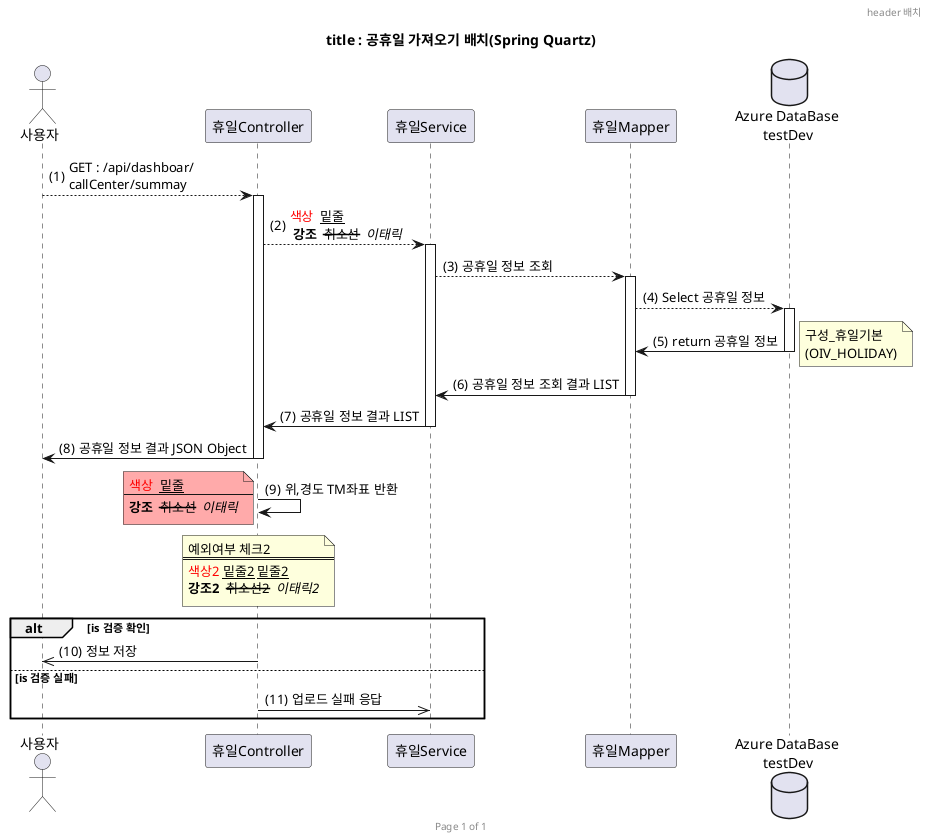
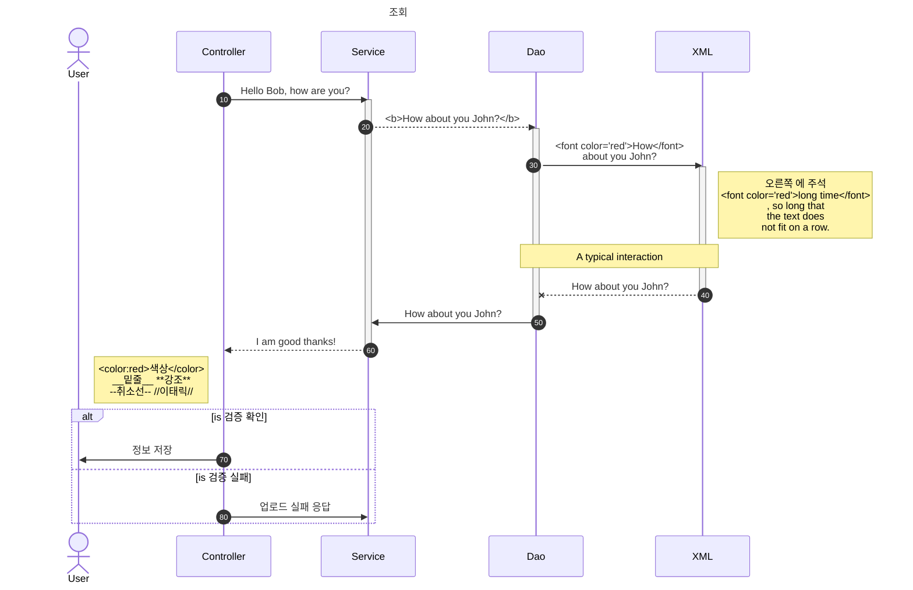

__문서제목__


== 목차 ==
<!-- 아래처럼주면 자동으로 목차가 생성된다. -->
<!-- @import "[TOC]" {cmd="toc" depthFrom=1 depthTo=6 orderedList=false} -->

<!-- code_chunk_output -->

- [1. 제목표시](#1-제목표시)
- [1. 강조표시](#1-강조표시)
- [2. 기울임](#2-기울임)
- [3. 혼용사용](#3-혼용사용)
- [4. 취소선](#4-취소선)
- [5. 밑줄](#5-밑줄)
- [6. 글자 정렬](#6-글자-정렬)
- [6. 글자 색,배경 변경](#6-글자-색배경-변경)
- [6. 형광팬](#6-형광팬)
- [6. 인용문](#6-인용문)
- [7. 순서있는 목록](#7-순서있는-목록)
- [8. \- , \* , \+ 순서없는 목록](#8-------순서없는-목록)
- [9.  ---를 세번 주고 엔터하면 선긋기](#9---를-세번-주고-엔터하면-선긋기)
- [10. 토글 리스트 (접기/펼치기)](#10-토글-리스트-접기펼치기)
- [10. 링크주기](#10-링크주기)
- [10. 인라인 HTML](#10-인라인-html)
- [11. 이미지 (Images) 붙이기](#11-이미지-images-붙이기)
- [12. ```를 주고 엔터치면 블럭주기](#12-를-주고-엔터치면-블럭주기)
- [13. `로 일부 글자에 대해 인라인 블럭주기](#13-로-일부-글자에-대해-인라인-블럭주기)
- [14. *공백 `[공백]` 공백 을 주어서 체크박스 만들기](#14-공백-공백-공백-을-주어서-체크박스-만들기)
- [15. 주석 달기](#15-주석-달기)
- [16. 목차 생성](#16-목차-생성)
- [17. 각주 달기](#17-각주-달기)
- [17. 축약어 (HTML)](#17-축약어-html)
- [18.\```plant uml하면 plantuml sequence diagram](#18font-colorredplant-umlfont하면-plantuml-sequence-diagram)
- [20. \```mermaid sequenceDiagram하면 mermaid sequence diagram](#20-font-colorredmermaid-sequencediagramfont하면-mermaid-sequence-diagram)
- [20. \```mermaid flowchart 하면 mermaid flowchart diagram](#20-font-colorredmermaid-flowchartfont-하면-mermaid-flowchart-diagram)
- [20. \```mermaid pie하면 mermaid pie diagram](#20-font-colorredmermaid-piefont하면-mermaid-pie-diagram)
- [21. \```sequence하면 markdown sequence diagram](#21-font-colorredsequencefont하면-markdown-sequence-diagram)
- [22. \```flow 를 하면 markdown flowchart](#22-font-colorredflowfont-를-하면-markdown-flowchart)
- [23. 테이블 만들기](#23-테이블-만들기)

<!-- /code_chunk_output -->


#### 1. 제목표시

  ```html
    h1: # 부(parts)에 사용됨.
    h2: ## 장(chapters)에 사용됨.
    h3: ### 페이지 섹션에 사용함.
    h4: #### 하위 섹션에 사용됨.
    h5: ##### 하위 섹션 아래의 하위 섹션에 사용됨.
    h6: ###### 문단에
  ```

  ```html
    # 부(parts)에 사용됨.
    ## 장(chapters)에 사용됨.
    ### 페이지 섹션에 사용함.
    #### 하위 섹션에 사용됨.
    ##### 하위 섹션 아래의 하위 섹션에 사용됨.
    ###### 문단에
  ```

<br/>

#### 1. 강조표시

  ```html
   **을 앞뒤로  넣어서 강조**
  ```

  ** **을 앞뒤로 넣어서 강조**

  ```html
    __볼드체(double underscores)__
  ```
  __볼드체(double underscores)__


#### 2. 기울임
  ```html
   *를 한번 넣어서 기울임*
  ```

  \* *를 한번 넣어서 기울임*

  ```html
    _이탤릭체(single underscores)_
  ```

   _이탤릭체(single underscores)_

#### 3. 혼용사용
  ```html
      **와 *를 *혼용*해서 사용**
  ```

  ** **와 \*를 *혼용*해서 사용**

  ```html
    **_이텔릭체_와 두껍게**를 같이 사용할 수 있습니다.
  ```

  **_이텔릭체_와 두껍게**를 같이 사용할 수 있습니다.


  ```html
   __*이텔릭체*와 두껍게__를 같이 사용할 수 있습니다.
  ```

  __*이텔릭체*와 두껍게__를 같이 사용할 수 있습니다.


  ```html
   **_이탤릭체와 볼드체 함께_**
  ```
  **_이탤릭체와 볼드체 함께_**

#### 4. 취소선
  ```html
   ~~물결을 두번 사용해서 취소선 ~~
  ```

  \~~~~물결을 두번 사용해서 취소선~~

#### 5. 밑줄

  ```html
    <u>밑줄 주기가 가능하다.</u>
  ```
   <u>밑줄 주기가 가능하다.</u>


#### 6. 글자 정렬
  - 마크다운은 가운데 정렬만 지원함. 왼쪽 오른쪽은 html 사용해야함
  ```html
  <center>가운데</center>
  <div style="text-align: left">왼쪽</div>
  <div style="text-align: right">오른쪽</div>
  ```

  <center>가운데</center>
  <div style="text-align: left">왼쪽</div>
  <div style="text-align: right">오른쪽</div>

<br/>

#### 6. 글자 색,배경 변경
 - 마크다운에서 따로 지원하지 않아서 html 사용해야함
 ```
 <span style="background-color: #11999e; color:white">글자 색, 배경 변경</span>
 ```
  <span style="background-color: #11999e; color:white">글자 색, 배경 변경</span>

<br>

#### 6. 형광팬
  - \<mark>형광팬\</mark>
  <mark>형광팬</mark>
  <mark color="red">형광팬</mark>

#### 6. 인용문
  - \>로  인용문장을 줄수있다.
    \>>중첩된 인용문
    \>>>중첩된 인용문 2

   > 인용문장을 줄수있다.
   >> 중첩된 인용문
   >>> 중첩된 인용문 2
   > * List 2


>> **<i class="fa fa-exclamation-triangle" aria-hidden="true"></i> 주의:** 이 구문은 마크다운 인용구 문법 입니다.

>> *<i class="fa fa-info-circle" aria-hidden="true"></i> 정보:* 이 구문은 마크다운 인용구 문법 입니다.

>> **<i class="fa fa-question-circle"></i> 질문:**
>> 질문 답변입니다.
>>
>>


#### 7. 순서있는 목록
  - 숫자적고 . 적고 공백하면 순서있는 목록
  1. 순서
     1. 순서 1-1
        1. 순서
     2. 순서 1-2
  2. 순서2

#### 8. \- , \* , \+ 순서없는 목록
   - -를 적고 공백주면  순서없는 목록
     * \*를 적고 공백
        + +를 적고 공백

#### 9.  ---를 세번 주고 엔터하면 선긋기
  ```html
     ---
     ***
  ```
   ---
   ***


#### 10. 토글 리스트 (접기/펼치기)
```
  <details>
  <summary><b><font color='red'>여기를 눌러주세요</font></b></summary>
  <div markdown="1">

    감춰진 테스트
  😎숨겨진 내용😎
    감춰진 테스트2

  </div>
  </details>
```

<details>
<summary><b><font color='red'>여기를 눌러주세요</font></b></summary>
<div markdown="1">

  감춰진 테스트
😎숨겨진 내용😎
  감춰진 테스트2

</div>
</details>

 <br>
 <br>

#### 10. 링크주기

  - 화면에 표시할 글은 `[]`(대괄호)로 감싸고, 이동할 주소에는 `()`(괄호)를 감싸서 입력하면 자동으로 링크를 생성할 수 있습니다.

  - 링크주기
    ```html
     [네이버이동](http://naver.com)
    ```
    [네이버이동](http://naver.com)


  - 새창으로 링크
     ```html
     ['네이버이동'](http://www.nate.com/){:target="_blank"}
     ```
     ['네이버이동'](http://www.nate.com/){:target="_blank"}

  - 새창으로 버튼 링크
     ```html
    ['test'](http://www.nate.com/){:.btn .btn-default target="_blank"}
     ```
    ['네이버이동'](http://www.nate.com/){:.btn .btn-default target="_blank"}


  - Lorem ipsum dolor sit amet, consectetur adipisicing elit. Quasi error quod libero corporis, iste sit nulla similique enim dignissimos asperiores, illo numquam architecto maxime ab tenetur repellendus, dicta sed officia.
  {:.text-right}


#### 10. 인라인 HTML
  - 마크다운에서 원시 HTML을 사용할 수도 있으며 대부분 잘 작동합니다. 하지만 PDF가 아닌 웹 사이트에만 표시됩니다.
  ```html
    <dl>
      <dt>아이템 1 제목</dt>
      <dd>아이템 1 내용 입니다.</dd>
      <dt>아이템 2 제목</dt>
      <dd>아이템 2 내용 입니다.</dd>
    </dl>

  ```

  <dl>
    <dt>아이템 1 제목</dt>
    <dd>아이템 1 내용 입니다.</dd>
    <dt>아이템 2 제목</dt>
    <dd>아이템 2 내용 입니다.</dd>
  </dl>


#### 11. 이미지 (Images) 붙이기

  - !\[대체텍스트](이미지주소)  와 같이 주면 된다.
    ```html
      
    ```
    
   <br/>

  - \[!\[대체텍스트](이미지주소)](링크주소)  와 같이 주면 링크도 된다.

    ```html
    [](http://naver.com)
    ```

    [](http://naver.com)
   <br/>

#### 12. ```를 주고 엔터치면 블럭주기
  - \```를 주고 언어를 주면 해당 언어(language)로 색상주기 가능
    > \```
    >  블럭 처리 \<span style="color:red">test \</span>
    > \```


    ```
    블럭 처리<span style="color:red">test </span>
    ```

  ---

  - \```java
    > \```java
    >   블럭 처리
    > \```

    ```java
    public doSearch(String id, string pwd){
        String result = id+pwd;
        return result;
    }
    ```

  ---

  - \```html
    > \```html
    >  블럭 처리
    > \```

    ```html
    <table><tr><td>블럭 처리</td></tr></table>
    <a href="javascript:alert('3')">테스트 </a>
    ```

  ---

  - \```css
    > \```css
    >  블럭 처리
    > \```

    ```css
      .div{
        background-color : red
      }
    ```
  ---

  - \```javascript
    > \```javascript
    > 블럭 처리
    > \```

    ```javascript
      function doSearch(){
        let cond = '';
        console.log("cond"+cond);
      }
     ```

<br/>

#### 13. `로 일부 글자에 대해 인라인 블럭주기
  ```
    `일부 글자` 블럭주기
  ```
   `일부 글자` 블럭주기
  <br/>

#### 14. *공백 `[공백]` 공백 을 주어서 체크박스 만들기
  ```
    * [ ] 사과
    * [ ] 배
    * [x] 귤
    * [ ] 체크내용
  ```

  * [ ] 사과
  * [ ] 배
  * [x] 귤
  * [ ] 체크내용

#### 15. 주석 달기
   \<!-- 주석 달기 -->
   <!-- 주석 달기 -->

#### 16. 목차 생성
  ```
    [보여지는 내용](#링크)
    또는
    문서 내에 사용된 헤딩 태그들을 이용하여 {:toc} 입력 시 목차가 자동 생성된다

  ```

  ```html
  <!-- 아래처럼 하면  목차가 자동으로 생성된다.-->
  <!-- @import "[TOC]" {cmd="toc" depthFrom=1 depthTo=6 orderedList=false} -->

  <!-- code_chunk_output -->
  <!-- /code_chunk_output -->
  ```

  ```html
    [16.목차 생성하는법](#16-목차-생성)
  ```
  - [16.목차 생성하는법](#16-목차-생성)


#### 17. 각주 달기
  ```
    마크다운 장난[^장난]없이 많이 좋다.[^총평]

    [^장난]:마크다운 사용법1
    [^총평]:마크다운 사용법2
    *[장난]: 장난에 대한 설명
  ```

  - 마크다운 장난[^장난]없이 많이 좋다.[^총평]
    [^장난]:마크다운 사용법1
    [^총평]:마크다운 사용법2

  - 마크다운 장난[^장난2]없이 많이 좋다.  [^총평2]
    [^장난2]:마크다운 사용법11
    [^총평2]:마크다운 사용법22
    *[장난]: 장난에 대한 설명

<br/>

#### 17. 축약어 (HTML)
   ```html
   -  This is an HTML example.

   *[HTML]: Hyper Text Markup Language 설명이다

   ```
   -  This is an HTML example.

   *[HTML]: Hyper Text Markup Language 설명이다

<br/>

#### 18.\```<font color="red">plant uml</font>하면 plantuml sequence diagram

https://plantuml.com/ko/sequence-diagram

```java
   ```plantuml
      Alice -> Bob: Authentication Request
      Bob --> Alice: Authentication Response

      Alice -> Bob: Another authentication Request
      Alice <-- Bob: another authentication Response
   ```

```

   ```plantuml
   Alice -> Bob: Authentication Request
   Bob --> Alice: Authentication Response

   Alice -> Bob: Another authentication Request
   Alice <-- Bob: another authentication Response
   ```


---


```java
    ```plantuml

    @startuml
    header header 배치
    footer Page %page% of %lastpage%
    title "title : 공휴일 가져오기 배치(Spring Quartz)"

    autonumber
    actor "사용자"
    participant "사용자" order 10
    participant "휴일Controller" order 20
    participant "휴일Service" order 30
    participant "휴일Mapper" order 40
    database "Azure DataBase\n testDev" order 50
    participant "Azure DataBase\n testDev" order 50

    actor "사용자"
    "사용자" --> "휴일Controller" :  GET : /api/dashboar/callCenter/summay
    ' 주석
    /'
     여러줄 주석
    '/

    activate "휴일Controller"
    "휴일Controller" ->  "휴일Service" : 공휴일 정보

    activate "휴일Service"
    "휴일Service" ->  "휴일Mapper" : 공휴일 정보 조회

    activate "휴일Mapper"
    "휴일Mapper" ->  "Azure DataBase\n testDev" : Select 공휴일 정보

    activate "Azure DataBase\n testDev"
    "Azure DataBase\n testDev" --> "휴일Mapper"   : return 공휴일 정보
    note right : 구성_휴일기본\n(OIV_HOLIDAY)
    deactivate "Azure DataBase\n testDev"

    "휴일Mapper" -->  "휴일Service" : 공휴일 정보 조회 결과 LIST
    deactivate "휴일Mapper"

    "휴일Service" -->  "휴일Controller" : 공휴일 정보 결과 LIST
    deactivate "휴일Service"

    "휴일Controller" ->  "사용자" : 공휴일 정보 결과 JSON Object
    deactivate "휴일Controller"

    'deactivate "휴일Controller"
    'activate "휴일Controller"

    "휴일Controller" ->  "휴일Controller" : 위,경도 TM좌표 반환
    note left #FFAAAA
      <color:red>색상</color>  __밑줄__
      ====
      **강조**  --취소선--  //이태릭//
    end note

    note over 휴일Controller
        예외여부 체크2
        ===
        <color:red>색상2</color> __밑줄2__ <u>밑줄2</u>
        **강조2**  --취소선2--  //이태릭2//
    end note

    alt is 검증 확인
        "휴일Controller"  ->> "사용자": 정보 저장
    else is 검증 실패
        "휴일Controller"  ->> "휴일Service": 업로드 실패 응답
    end

    @enduml
    ```

```




---


#### 20. \```<font color="red">mermaid sequenceDiagram</font>하면 mermaid sequence diagram

 https://mermaid.js.org/syntax/sequenceDiagram.html

```
   __제목: mermaid sequence diagram2__
    Here is a Hello World example.
    https://mermaid.js.org/syntax/sequenceDiagram.html
```
```java
    ```mermaid
    ---
    title: 조회
    ---
    sequenceDiagram

    autonumber
    participant User
    participant Controller
    participant Service
    participant Dao
    participant XML

    Controller ->> Service: Hello Bob, how are you?

    activate Service
    Service -->>Dao: How about you John?

    activate Dao
    Dao ->> XML: How about you John?

    activate XML
    Note right of XML: 오른쪽 에 주석 <br/>long time, so long<br/>that the text does<br/>not fit on a row.

    XML--x Dao: How about you John?
    deactivate XML

    Dao->> Service: How about you John?
    deactivate Dao

    Service-->> Controller : I am good thanks!
    deactivate Service


    alt is 검증 확인
      Controller  ->> User: 정보 저장

    else is 검증 실패
      Controller  ->>Service: 업로드 실패 응답

    end
    ```

```


__제목: mermaid sequence diagram2__
Here is a Hello World example.
https://mermaid.js.org/syntax/sequenceDiagram.html


<!--
%%{init: {'theme': 'base'
         , 'themeVariables': {'labelBoxBkgColor': 'lightgrey'
                            , 'labelBoxBorderColor': '#000000'
                            , 'actorBorder': '#D86613'
                            , 'actorBkg': '#ffffff'
                            , 'activationBorderColor': '#232F3E'
                            , 'activationBkgColor': '#D86613'
                            , 'noteBkgColor': 'rgba(255, 153, 0, .25)'
                            , 'noteBorderColor': '#232F3E'
                            }
             }
    }%%

-->



####  20. \```<font color="red">mermaid flowchart</font> 하면 mermaid flowchart diagram

https://mermaid.js.org/syntax/flowchart.html

```java
    ```mermaid
    flowchart TD
      nStart[Start]
      nOperation[Your Operation]
      nCondition{Yes or No?}
      nCondition2{{Yes2 or No2?}}
      nDb[(Database_1)]
      nEnd[End]

      nStart-->nOperation -->nCondition
      nCondition--Yes-->nDb-->nCondition2--Yes-->nEnd
      nCondition-. No .->nOperation

      nCondition2-.NO.->nCondition
    ```

```


---

####  20. \```<font color="red">mermaid pie</font>하면 mermaid pie diagram

https://mermaid.js.org/syntax/pie.html


```java
    ```mermaid
    pie showdata
        title Pie Chart
        "Dogs" : 386
        "Cats" : 85
        "Rats" : 150
    ```
```


#### 21. \```<font color="red">sequence</font>하면 markdown sequence diagram


https://bramp.github.io/js-sequence-diagrams/

```
    __제목 : markdown sequence__
    Here is a Hello World example.
```
```java


    ```sequence{theme="hand or simple"}

    participant User
    participant 포탈인버터장비Controller
    participant 포탈인버터장비Service
    participant 포탈인버터장비Mapper
    participant Database

    User -> 포탈인버터장비Controller   : 정보요청

    포탈인버터장비Controller -> 포탈인버터장비Controller : 유효성체크

    포탈인버터장비Controller -> 포탈인버터장비Service : 정보요청

    포탈인버터장비Service -> 포탈인버터장비Mapper : 정보요청

    포탈인버터장비Mapper -> Database : 정보요청
    Note right of Database : 휴일_에너지사용량기준목록

    Database -> 포탈인버터장비Mapper : return 정보결과
    포탈인버터장비Mapper -> 포탈인버터장비Service : 정보결과

    포탈인버터장비Service -> 포탈인버터장비Controller : 정보결과
    Note left of 포탈인버터장비Controller : 예외여부 체크
    포탈인버터장비Controller -> User : 인버터장비 등록결과 JSON Object\\n-건물ID,오브젝트ID,장비명
    ```

```

__제목 : markdown sequence__
Here is a Hello World example.


```sequence{theme="simple"}

participant User
participant 포탈인버터장비Controller
participant 포탈인버터장비Service
participant 포탈인버터장비Mapper
participant Database

User -> 포탈인버터장비Controller   : 정보요청
포탈인버터장비Controller -> 포탈인버터장비Controller : 유효성체크

포탈인버터장비Controller -> 포탈인버터장비Service : 정보요청

포탈인버터장비Service -> 포탈인버터장비Mapper : 정보요청

포탈인버터장비Mapper -> Database : 정보요청
Note right of Database : 휴일_에너지사용량기준목록

Database -> 포탈인버터장비Mapper : return 정보결과

포탈인버터장비Mapper -> 포탈인버터장비Service : 정보결과

포탈인버터장비Service -> 포탈인버터장비Controller : 정보결과

Note left of 포탈인버터장비Controller : 예외여부 체크


포탈인버터장비Controller -> User : 인버터장비 등록결과 JSON Object\n-건물ID,오브젝트ID,장비명

```

#### 22. \```<font color="red">flow</font> 를 하면 markdown flowchart
http://flowchart.js.org/

```java
    __제목: markdown flow__
    Here is a Hello World example.

    ```flow
    nStart=>start: Start(start)

    nOperation=>operation: Your Operation(operation)
    nCondition=>condition: Yes or
    No(condition)?

    nEnd=>end: End(end)

    nStart->nOperation->nCondition
    nCondition(yes)->nEnd
    nCondition(no)->nOperation
    ```

```

__제목: markdown flow__
Here is a Hello World example.

```flow
nStart=>start: Start(start)
nOperation=>operation: Your Operation(operation)
nCondition=>condition: Yes or
No(condition)?

nEnd=>end: End(end)

nStart->nOperation->nCondition
nCondition(yes)->nEnd
nCondition(no,right)->nOperation


```


---

```java

    ```flow
    nStart=>start: Start내용(start):>http://www.google.com[blank]
    nEnd=>end: End내용(end):> http://www.google.com
    nLoginForm=>operation: 로그인(operation)
    nLoginLog=>subroutine: 로그인로그(subroutine)
    nDatabase1=>subroutine: Database1
    nDatabase2=>subroutine: Database2
    pLoginCheck=>condition: Yes or No?(condition):>http://www.google.com
    pLoginSucces=>inputoutput: Main화면(inputoutput)...
    pLoginFail=>parallel: 여러작업만(parallel)

    nStart->nLoginForm->pLoginCheck
    pLoginCheck(yes)->pLoginSucces->nEnd
    pLoginCheck(no)->pLoginFail

    pLoginFail(path1, bottom)->nLoginLog(right)->nLoginForm
    pLoginFail(path2, top)->nLoginForm
    pLoginFail(path3, right)->nDatabase1

    nLoginLog(bottom)->nDatabase2
    ```

```

  __flowchart  (```flow)  http://flowchart.js.org/ 의 flowchar.js를 보면 속성들이 있다.__
  ```flow
  nStart=>start: Start내용(start):>http://www.google.com[blank]
  nEnd=>end: End내용(end):> http://www.google.com
  nLoginForm=>operation: 로그인(operation)
  nLoginLog=>subroutine: 로그인로그(subroutine)
  nDatabase1=>subroutine: Database1
  nDatabase2=>subroutine: Database2
  pLoginCheck=>condition: Yes or No?(condition):>http://www.google.com
  pLoginSucces=>inputoutput: Main화면(inputoutput)...
  pLoginFail=>parallel: 여러작업만(parallel)

  nStart->nLoginForm->pLoginCheck
  pLoginCheck(yes)->pLoginSucces->nEnd
  pLoginCheck(no)->pLoginFail

  pLoginFail(path1, bottom)->nLoginLog(right)->nLoginForm
  pLoginFail(path2, top)->nLoginForm
  pLoginFail(path3, right)->nDatabase1

  nLoginLog(bottom)->nDatabase2
  ```

  ----
  **flow**
  ```java
    ```flow
    <!--
    사용가능한 프로세스
      start
      end
      operation
      condition
      subroutine
      parallel
    -->
    nStart=>start: Start(start)|past:>http://www.google.com[blank]
    nEnd=>end: End(end)|future:>http://www.google.com

    nOperation1=>operation: 작업1(operation)|past
    nOperation2=>operation: 작업2(operation)|current

    nSubroutine=>subroutine: 서브루틴(subr..)|invalid
    nCondition1=>condition: Yes
    or No?(condition)|approved:>http://www.google.com

    nCondition2=>condition: Good idea|rejected

    nInputoutput=>inputoutput: catch something(inputoutput)...|future

    nStart->nOperation1(right)->nCondition1

    nCondition1(yes, right)->nCondition2
    nCondition1(no)->nSubroutine(left)->nOperation1

    nCondition2(yes)->nInputoutput->nEnd
    nCondition2(no)->nOperation2->nEnd
    ```
```


**flowchart  (```flow)  http://flowchart.js.org/ 의 flowchar.js를 보면 속성들이 있다.**
```flow
nStart=>start: Start(start)|past:>http://www.google.com[blank]
nEnd=>end: End(end)|future:>http://www.google.com

nOperation1=>operation: 작업1(operation)|past
nOperation2=>operation: 작업2(operation)|current

nSubroutine=>subroutine: 서브루틴(subr..)|invalid
nCondition1=>condition: Yes
or No?(condition)|approved:>http://www.google.com

nCondition2=>condition: Good idea|rejected

nInputoutput=>inputoutput: catch something(inputoutput)...|future

nStart->nOperation1(right)->nCondition1

nCondition1(yes, right)->nCondition2
nCondition1(no)->nSubroutine(left)->nOperation1

nCondition2(yes)->nInputoutput->nEnd
nCondition2(no)->nOperation2->nEnd
```
-----------------------


#### 23. 테이블 만들기

첫번째행을  -(하이픈)으로 구별하고 각열을 |(수직선기호) 로 구별하여 표를 만든다.

|첫째행 | 둘째행|  하고 엔터

| 헤더1     |        헤더2 |  헤더3   |
| :-------- | -----------: | :------: |
| 좌측 정렬 | 우측 정렬233 | 중앙정렬 |
| 열1       |          열2 |   열3    |

| 첫째행 | 둘째행 |
| ------ | ------ |
|        |        |

​
